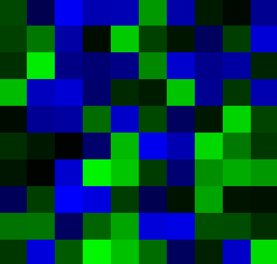

# Simplex noise Java SWT

## Disclaimer

The code runs really poorly with a grid bigger than 100 x 100.

## Set up

1. clone the repository onto your pc.
2. open the project and run mvn package or mvn clean install
3. start the program by running the Main.java class.

## Result

As a result, a window opens and with rectangle drawn into it, which represent the value of the perlin noise map.

Example:

# Imagine

Imagine a world where you can generate a map with a seed and a grid size.

Imagine SWT would be a good library to use for this.

Imagine one would fake a camera movement by moving the grid and redrawing the map.

Imagine this would just work.

